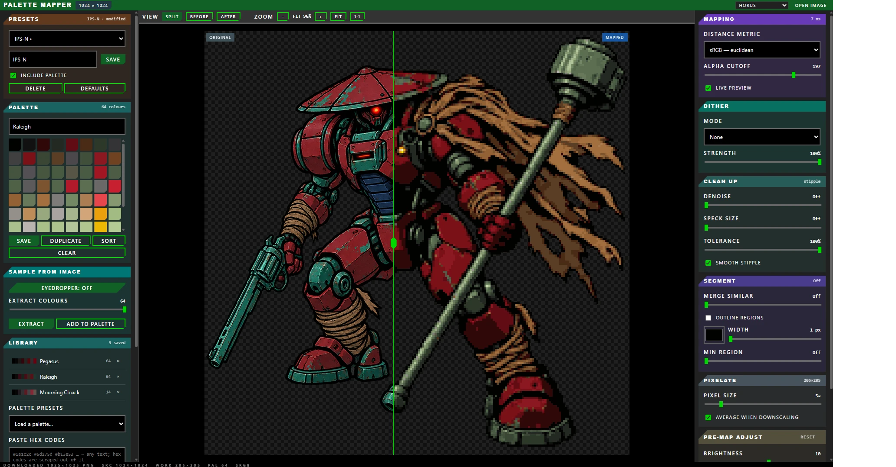

# Palette Mapper

Paste in an image, build a colour palette, and every pixel snaps to its nearest palette colour.
Tune it live, then download or copy the result.

It runs entirely in your browser. Nothing is uploaded, there's no account, and it works offline
once the page has loaded — which matters if you're putting client artwork through it.

---

## Quick start

1. **Get an image in.** Press <kbd>Ctrl</kbd>+<kbd>V</kbd>, drag a file onto the page, or hit
   *Choose an image*.
2. **Get a palette.** Fastest route: open *Sample from image* and press **Extract**. That pulls
   the most representative colours straight out of your picture. Or load one from *Palette
   presets*.
3. **Tune.** Drag sliders in the right-hand panel and watch the split view update.
4. **Export.** Press **Download**, or **Copy PNG** to put it straight on the clipboard.

The centre view is split: original on the left, mapped on the right. Drag the divider, or press
<kbd>1</kbd> / <kbd>2</kbd> / <kbd>3</kbd> for before, split, and after.

---

## Building a palette

Five ways, all in the left-hand panel.

| | How |
| --- | --- |
| **Extract** | Pulls the N most representative colours out of the image. Set the count, press *Extract* to replace the palette or *Add to palette* to append. |
| **Eyedropper** | Toggle it on and click the image to grab exact colours. It samples the original at full resolution, so what you click is what you get regardless of zoom. |
| **By hand** | Click **+** to add a swatch, click a swatch to edit it with the picker or by typing a hex value. Reorder by dragging, or with the **◀ Move / Move ▶** buttons. |
| **Import** | Paste *any* text containing hex codes — a Lospec page, a CSS file, a column of codes — and they'll be scraped out. Or load a `.hex`, `.gpl`, `.pal`, `.act` or `.json` file. |
| **Presets** | Game Boy, PICO-8, Sweetie 16, CGA 16, Solarized, greyscale ramps and web-safe. |

**Sort** reorganises the palette into ramps, the way a hand-built palette is usually laid out:
the greys first running dark to light, then each colour family in turn round the wheel from red,
every family also running dark to light. It splits a family further when it holds both a muted
and a saturated ramp — Sweetie 16's blue-greys and its vivid blues come out as two separate runs
rather than interleaved. Nothing is added or removed, so it's safe to hit at any point.

Palettes you **Save** go to the *Library* and stay there between sessions. You can export one as
`.hex` or `.gpl` to use in Aseprite, Photoshop or GIMP, or **Copy list** to grab the hex codes.

> **Tip** — extracting first and then hand-editing usually beats starting from scratch. Extract
> 16–64 colours, delete the ones you don't want, then nudge the rest.

---

## The controls

### Mapping

**Distance metric** decides what "nearest colour" means.

- **OKLab** is perceptual and the right default — it matches how your eye judges closeness.
- **sRGB** is a straight numerical match. It can hold saturated colours better on flat graphic
  work, and it's worth trying when OKLab looks muted.
- **Weighted RGB** sits between the two.

Switch between them and watch the split — on some images they're indistinguishable, on others
the difference is obvious.

**Alpha cutoff** sets where semi-transparent pixels become fully solid or fully invisible. Raise
it to bite harder into soft edges and cut a subject cleanly off its background; lower it to keep
more of the fringe.

### Dither

Scatters pixels between two palette colours to fake shades you don't have.

- **None** — right for flat, cel-shaded or graphic art.
- **Floyd–Steinberg** — organic, photographic. The usual choice for photos and paintings.
- **Bayer 4×4 / 8×8** — a regular crosshatch, for a deliberately retro or print-screen look.

**Strength** dials the effect back. Dithering is most useful with small palettes; with 64 colours
you often want none at all.

### Pixelate

**Pixel size** sets how many source pixels become one output block. This is measured against your
*original* image, so the preview shows exactly the block structure the export will have.

**Average when downscaling** blends each block into one colour (usually what you want). Turn it
off to sample a single pixel per block, which keeps edges harsher and colours more original.

> **Tip** — pixel size and export **Upscale** are separate on purpose. Pixel size 5 on a 1024px
> image gives a true 205px pixel-art file; set Upscale to 5 to blow it back up to roughly its
> original dimensions with crisp square blocks. (Sizes that don't divide evenly shift the final
> dimensions by a pixel or two.)

### Pre-map adjust

Brightness, contrast, saturation and gamma, applied **before** matching. This is often the
difference between a muddy result and a good one: if your palette is darker than your image,
pulling brightness down first gives the matcher something closer to work with. **Reset** puts
them all back.

### Clean up

Mapping a compressed source (a JPEG, or anything saved off the web) scatters stray pixels through
large flat areas. That's not really a mapping fault — JPEG ringing nudges pixels far enough to
cross a decision boundary, so they snap to a different colour. Two controls attack it, and both
start switched off.

- **Denoise** smooths the image *before* matching so the stray pixels never happen. It's a median
  filter, so it removes speckle without softening hard edges. Radius 2 is where it starts doing
  real work.
- **Speck size** removes stray patches *after* matching, absorbing anything this size or smaller
  into whatever surrounds it.
- **Tolerance** is the important one. A patch is only absorbed if its colour is close to its
  neighbour's. That's what separates an artifact from a detail — a slightly-off orange speck in a
  field of orange gets absorbed, while a deliberate black pupil the same size survives, because
  black is nowhere near orange. At 0 nothing is ever absorbed.
- **Smooth stipple** cleans the ragged single-pixel chains that form along antialiased edges,
  which are too stringy for a size filter to catch.

> **Recipe for a compressed source** — Denoise 1, Speck size 8, Tolerance 50–60, Smooth stipple
> on. On a JPEG cartoon that removes roughly 80% of the speckle while leaving the linework alone.

### Segment

**Merge similar** collapses palette colours that are close to each other, flattening the image
toward a poster or paint-by-numbers look. Push it far enough and you'll get down to a handful of
colours.

**Outline regions** draws lines along the borders between colour areas, in any colour you pick,
1 to 7 px wide.

**Min region** decides how big an area has to be before it earns an outline. Leave it at 0 and
every boundary gets a line, including around every speck — which is what makes outlines look
thick and doubled, since a sliver between two areas contributes two lines a pixel apart. Raise it
until the small stuff drops out and only the shapes you care about are drawn.

---

## Exporting

**Download** saves a PNG (also <kbd>Ctrl</kbd>+<kbd>S</kbd>). **Copy PNG** puts it on the
clipboard — if your browser refuses, it downloads instead and tells you.

**Upscale** enlarges with hard square edges, so pixel art stays crisp. **Render at full
resolution** re-processes the original at full size on export; untick it to export exactly the
(smaller) image you see in the preview.

The header of the Export card always shows the dimensions you'll actually get.

---

## Presets

The **Presets** card saves every processing setting on the page under a name — metric, dither,
pixelate, adjustments, clean up, segment, outlines and export scale. Tick *Include palette* and
the palette travels with it, so one preset can carry an entire look.

Five to start from: **Clean cel art**, **Flat poster**, **Ink lines**, **Pixel art 8×** and
**Photo dither**. They leave your palette alone and can't be deleted.

The card header tells you where you stand — `Defaults`, `Custom`, the preset's name, or
`Ink lines · modified` once you change something. **Defaults** puts every control back.

Theme, zoom and view mode deliberately aren't saved in a preset — those are how you're looking at
the work, not how the image is processed.

---

## Handy to know

- **Keyboard** — <kbd>Ctrl</kbd>+<kbd>V</kbd> paste, <kbd>Ctrl</kbd>+<kbd>S</kbd> download,
  <kbd>1</kbd>/<kbd>2</kbd>/<kbd>3</kbd> before/split/after, arrows nudge the split divider.
- **Paste a palette** — pasting text that contains hex codes, rather than an image, loads them as
  a palette. Copy a row of swatches off a palette site and paste straight into the page.
- **What you see is what you export.** The preview works on a smaller copy for speed, but the
  cleanup and outline size thresholds are measured against your original's resolution, so a speck
  that vanishes in the preview vanishes in the export too.
- **Transparency is all-or-nothing.** Every visible pixel is exactly one of your palette colours,
  which means half-transparent pixels can't survive — they'd blend into something that isn't in
  your palette at all. The alpha cutoff is where you control that line.
- **The one exception** — outlines use a free colour picker, so an outline colour that isn't in
  your palette is the only way a non-palette colour reaches the export. The picker follows your
  palette's darkest colour until you change it, and the Segment header warns you with
  `+1 off-palette` when it's not one of yours.
- **First denoise is slow** on a big image (a few seconds at radius 2–3), then instant — the
  result is reused while you adjust everything else.
- **Themes** — eleven of them in the top-right, including a high-contrast one.
- **On a phone** — the image gets the whole screen and the panels slide up from the bar at the
  bottom. The sheet deliberately stops short of full height so you can watch the image change
  while dragging a slider.

---

## Running and hosting it

Open `index.html` and it works. To put it online, push the folder to a repo and point **GitHub
Pages** at it — there's no build step and no dependencies. All paths are relative, so it works
from `https://yourname.github.io/yourrepo/` unchanged.
